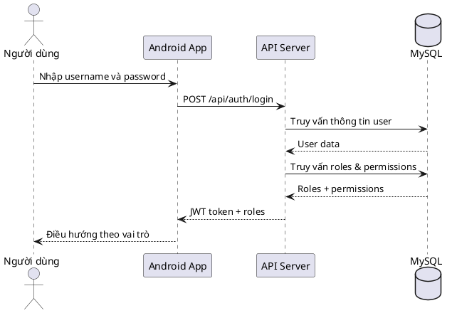
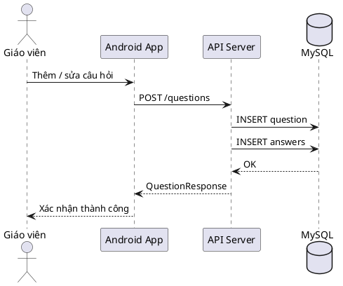
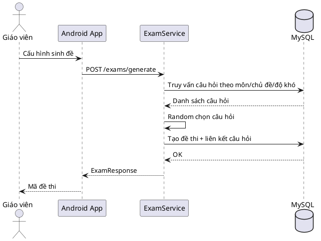
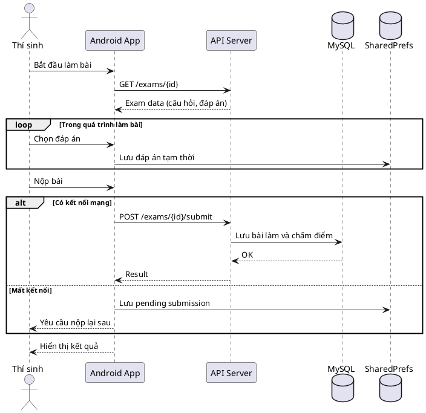
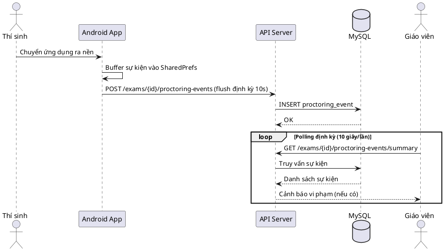
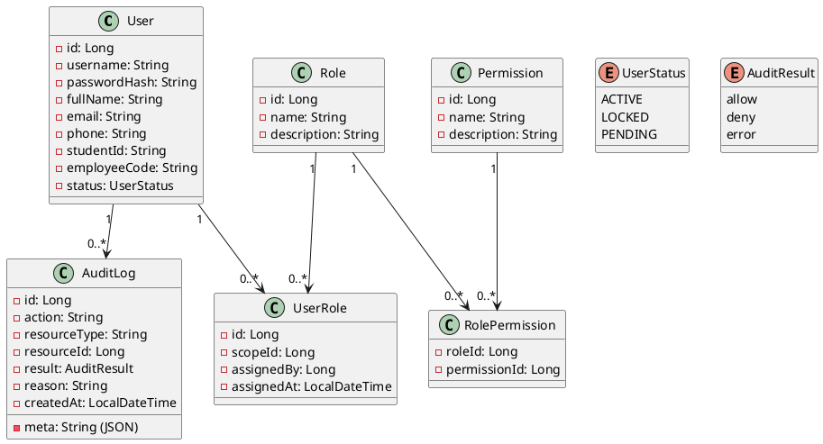
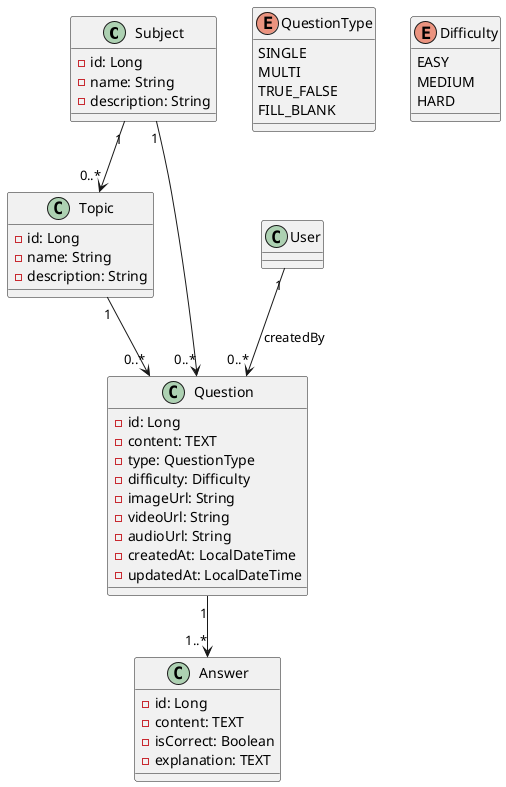
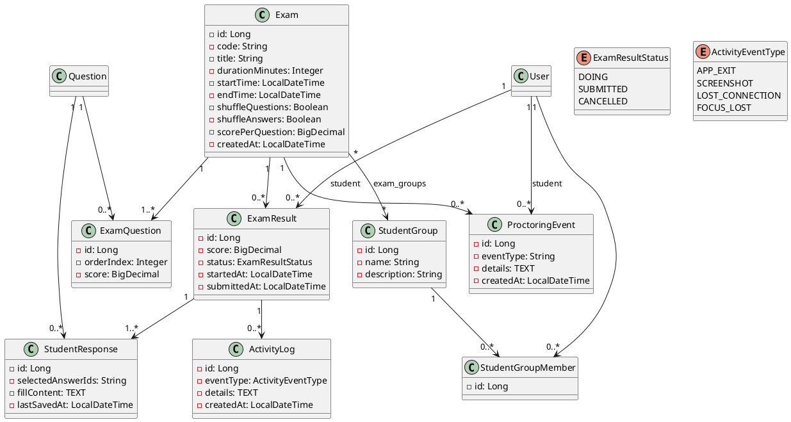

# CHƯƠNG 2. PHÂN TÍCH, THIẾT KẾ HỆ THỐNG

Sau khi Chương 1 đã trình bày bối cảnh, ý nghĩa đề tài và bài toán tổng quan đối với hệ thống thi trắc nghiệm, Chương 2 tập trung đi sâu vào việc phân tích và thiết kế hệ thống. Cụ thể, chương sẽ làm rõ yêu cầu nghiệp vụ và yêu cầu người dùng, xây dựng mô hình nghiệp vụ, mô hình chức năng, mô hình dữ liệu và kiến trúc tổng thể của hệ thống. Đây là cơ sở quan trọng để triển khai cài đặt, kiểm thử và đánh giá kết quả ở Chương 3.

Nội dung chính của Chương 2 bao gồm: phân tích yêu cầu hệ thống, mô tả các quy trình nghiệp vụ liên quan đến việc quản lý ngân hàng câu hỏi, đề thi, người dùng và kết quả thi; xác định các actor, use case; xây dựng mô hình dữ liệu và thiết kế cơ sở dữ liệu; đề xuất kiến trúc hệ thống và định hướng thiết kế giao diện người dùng.

## 2.1. Tổng quan thiết kế hệ thống

### 2.1.1. Kiến trúc tổng thể hệ thống

Hệ thống được thiết kế theo mô hình Client-Server với kiến trúc nhiều tầng (multi-tier architecture), bao gồm các thành phần chính sau:

- **Tầng Client (Frontend - Android)**: Ứng dụng di động được xây dựng bằng ngôn ngữ Kotlin với Jetpack Compose và Material 3, hỗ trợ ba vai trò người dùng: Admin, Giáo viên và Thí sinh. Ứng dụng sử dụng kiến trúc MVVM, Retrofit cho giao tiếp API, và SharedPreferences cho lưu trữ trạng thái bài làm tạm thời.

- **Tầng Server (Backend - Spring Boot REST API)**: API được xây dựng bằng Java Spring Boot 2.7.14, cung cấp các REST endpoints cho toàn bộ nghiệp vụ hệ thống. Sử dụng Spring Security với JWT cho xác thực và phân quyền, JPA/Hibernate cho tương tác cơ sở dữ liệu.

- **Tầng Cơ sở dữ liệu (MySQL)**: Lưu trữ toàn bộ dữ liệu nghiệp vụ bao gồm thông tin người dùng, phân quyền, ngân hàng câu hỏi, đề thi, kết quả thi và nhật ký hoạt động.

Kiến trúc tổng thể được mô tả như sau:

```
┌─────────────────────────────────────────────────────────────────┐
│                        TẦNG CLIENT                              │
│  ┌──────────────────────────────────────────────────────────┐   │
│  │                Android App (Kotlin)                      │   │
│  │  ┌──────────┐  ┌──────────┐  ┌──────────────────────┐   │   │
│  │  │Auth      │  │Student   │  │Teacher               │   │   │
│  │  │Screens   │  │Screens   │  │Screens               │   │   │
│  │  └──────────┘  └──────────┘  └──────────────────────┘   │   │
│  │  ┌──────────────────────────────────────────────────┐   │   │
│  │  │         Retrofit + OkHttp (API Client)           │   │   │
│  │  └──────────────────────────────────────────────────┘   │   │
│  │  ┌──────────────────────┐  ┌────────────────────────┐   │   │
│  │  │  SharedPreferences   │  │   ExamAttemptStore     │   │   │
│  │  │  (Lưu đáp án tạm)    │  │   (Trạng thái bài làm) │   │   │
│  │  └──────────────────────┘  └────────────────────────┘   │   │
│  └──────────────────────────────────────────────────────────┘   │
└─────────────────────────────────────────────────────────────────┘
                              │
                        HTTP / HTTPS
                              │
┌─────────────────────────────────────────────────────────────────┐
│                     TẦNG SERVER (Backend)                       │
│  ┌──────────────────────────────────────────────────────────┐   │
│  │              Spring Boot REST API (Java)                 │   │
│  │  ┌──────────┐  ┌────────────┐  ┌─────────────────────┐  │   │
│  │  │Security  │  │Controllers │  │Services             │  │   │
│  │  │Layer     │  │            │  │(Business Logic)     │  │   │
│  │  │- JWT     │  │- Auth      │  │- UserService        │  │   │
│  │  │- Filter  │  │- User      │  │- RbacService        │  │   │
│  │  │- RBAC    │  │- Rbac      │  │- QuestionService    │  │   │
│  │  └──────────┘  │- Question  │  │- ExamService        │  │   │
│  │                 │- Exam      │  │- ResultService      │  │   │
│  │                 │- Result    │  │- GradingService     │  │   │
│  │                 │- Group     │  │- ProctoringService  │  │   │
│  │                 │- Proctor   │  └─────────────────────┘  │   │
│  │                 └────────────┘                           │   │
│  │  ┌──────────────────────────────────────────────────┐   │   │
│  │  │          Repository Layer (JPA / Hibernate)      │   │   │
│  │  └──────────────────────────────────────────────────┘   │   │
│  └──────────────────────────────────────────────────────────┘   │
└─────────────────────────────────────────────────────────────────┘
                              │
                         JDBC / TCP
                              │
┌─────────────────────────────────────────────────────────────────┐
│                     TẦNG DỮ LIỆU                                │
│  ┌──────────────────────────────────────────────────────────┐   │
│  │              MySQL Database                              │   │
│  │  ┌──────────┐  ┌────────────┐  ┌─────────────────────┐  │   │
│  │  │RBAC      │  │Question    │  │Exam / Result        │  │   │
│  │  │Tables    │  │Bank Tables │  │Tables               │  │   │
│  │  └──────────┘  └────────────┘  └─────────────────────┘  │   │
│  └──────────────────────────────────────────────────────────┘   │
└─────────────────────────────────────────────────────────────────┘
```

**Các công nghệ và framework sử dụng:**

| Thành phần | Công nghệ | Phiên bản |
|------------|-----------|-----------|
| Ngôn ngữ Backend | Java | 11 |
| Framework Backend | Spring Boot | 2.7.14 |
| Xác thực | JWT (jjwt) | 0.11.5 |
| ORM | Hibernate / JPA | Spring Boot Starter Data JPA |
| Cơ sở dữ liệu | MySQL | 8.0 |
| Import Excel | Apache POI | 5.2.5 |
| Ngôn ngữ Frontend | Kotlin | - |
| UI Framework | Jetpack Compose + Material 3 | - |
| HTTP Client | Retrofit + OkHttp | - |
| Offline Storage | SharedPreferences (lưu đáp án tạm) | - |

**Nguyên tắc thiết kế:**
1. **Phân tách rõ ràng**: Tách biệt nghiệp vụ thi và nghiệp vụ quản trị, mỗi service đảm nhận một nhóm chức năng cụ thể.
2. **Bảo mật đa lớp**: Kết hợp JWT authentication, RBAC authorization và audit logging.
3. **Lưu trữ tạm khi mất kết nối**: Đáp án được lưu vào SharedPreferences trong suốt phiên làm bài. Nếu mất mạng khi nộp bài, dữ liệu được lưu lại để thí sinh có thể nộp lại thủ công sau. Tính năng đồng bộ tự động và cache câu hỏi offline dự kiến phát triển trong tương lai.
4. **Mở rộng được**: Thiết kế hướng tới việc dễ dàng bổ sung loại câu hỏi, môn học và quyền mới.

## 2.2. Biểu đồ Use case

### 2.2.1. Mô tả chức năng tác nhân trong hệ thống

Hệ thống có ba tác nhân (actor) chính:

**a) Admin (Quản trị viên)**
- Quản lý tài khoản người dùng (tạo, sửa, khóa/mở khóa)
- Phân quyền và gán vai trò cho người dùng
- Quản lý danh mục quyền và vai trò (RBAC)
- Xem nhật ký kiểm toán (audit log)
- Quản lý môn học và chủ đề
- Xem thống kê báo cáo toàn hệ thống

**b) Giáo viên (Teacher)**
- Quản lý ngân hàng câu hỏi (thêm, sửa, xóa, xem)
- Import câu hỏi từ file Excel
- Tạo đề thi thủ công
- Sinh đề thi tự động
- Quản lý nhóm thí sinh
- Theo dõi quá trình làm bài của thí sinh (giám sát realtime)
- Xem kết quả và thống kê chi tiết từng kỳ thi
- Quản lý câu hỏi trong đề thi

**c) Thí sinh (Student)**
- Đăng nhập và xác thực
- Xem danh sách bài thi được phân công
- Làm bài thi trên thiết bị di động
- Tự động lưu bài làm khi mất mạng
- Nộp bài thi
- Xem kết quả và chi tiết bài làm
- Xem giải thích đáp án

### 2.2.2. Xây dựng Biểu đồ Use case

Biểu đồ use case tổng quát của hệ thống:

```mermaid
flowchart TD
    Admin((Admin))
    Teacher((Giáo viên))
    Student((Thí sinh))

    subgraph "Hệ thống thi trắc nghiệm"
        UC1[Đăng nhập]
        UC2[Quản lý tài khoản]
        UC3[Quản lý câu hỏi]
        UC4[Import Excel câu hỏi]
        UC5[Tạo đề thi thủ công]
        UC6[Sinh đề thi tự động]
        UC7[Làm bài thi]
        UC8[Tự lưu đáp án tạm thời]
        UC9[Nộp bài / Auto submit]
        UC10[Giám sát thi - Proctoring]
        UC11[Chấm điểm tự động]
        UC12[Xem kết quả thi]
        UC13[Thống kê / Báo cáo]
        UC14[Quản lý nhóm thí sinh]
        UC15[Quản lý môn học / chủ đề]
        UC16[Quản lý phân quyền RBAC]
        UC17[Xem audit log]
    end

    Admin --> UC1
    Admin --> UC2
    Admin --> UC14
    Admin --> UC15
    Admin --> UC16
    Admin --> UC17
    Admin --> UC13

    Teacher --> UC1
    Teacher --> UC3
    Teacher --> UC4
    Teacher --> UC5
    Teacher --> UC6
    Teacher --> UC10
    Teacher --> UC11
    Teacher --> UC12
    Teacher --> UC13
    Teacher --> UC14
    Teacher --> UC15

    Student --> UC1
    Student --> UC7
    Student --> UC8
    Student --> UC9
    Student --> UC12
```



### 2.2.3. Đặc tả Use Case

#### Use case 1: Đăng nhập

| Mục | Mô tả |
|-----|-------|
| Tác nhân | Admin, Giáo viên, Thí sinh |
| Mô tả | Xác thực người dùng, cấp JWT token và điều hướng theo vai trò |
| Tiền điều kiện | Tài khoản đã tồn tại trong hệ thống |
| Hậu điều kiện | Người dùng nhận được token và thông tin vai trò, quyền hạn |

**Luồng sự kiện chính:**
1. Người dùng nhập username và password
2. Hệ thống gửi request `POST /api/auth/login` đến server
3. Server xác thực thông tin, tải vai trò và quyền từ cơ sở dữ liệu
4. Server tạo JWT token chứa thông tin người dùng
5. Client lưu token và điều hướng đến màn hình tương ứng với vai trò

**Luồng ngoại lệ:**
- Sai thông tin đăng nhập → từ chối xác thực, yêu cầu nhập lại
- Tài khoản bị khóa → từ chối đăng nhập, thông báo tài khoản đã bị khóa

#### Use case 2: Quản lý tài khoản

| Mục | Mô tả |
|-----|-------|
| Tác nhân | Admin |
| Mô tả | Tạo mới, cập nhật, khóa/mở khóa tài khoản người dùng |
| Tiền điều kiện | Admin đã đăng nhập và có quyền `user:create`, `user:update`, `user:lock` |
| Hậu điều kiện | Tài khoản được tạo/cập nhật/khóa thành công |

**Luồng sự kiện chính:**
1. Admin xem danh sách tài khoản (`GET /api/users`)
2. Admin tạo tài khoản mới với thông tin và vai trò (`POST /api/users`)
3. Admin cập nhật thông tin hoặc gán lại vai trò (`PUT /api/users/{id}`)
4. Admin khóa/mở khóa tài khoản (`PUT /api/users/{id}/lock` hoặc `unlock`)

**Luồng ngoại lệ:**
- Username, email hoặc mã sinh viên đã tồn tại → từ chối tạo mới, thông báo trùng thông tin
- Dữ liệu đầu vào không hợp lệ (thiếu trường bắt buộc) → yêu cầu bổ sung thông tin
- Không tìm thấy tài khoản cần cập nhật → thông báo không tồn tại
- Admin không có quyền thực hiện thao tác → từ chối truy cập

#### Use case 3: Quản lý câu hỏi

| Mục | Mô tả |
|-----|-------|
| Tác nhân | Giáo viên, Admin |
| Mô tả | Thêm, sửa, xóa câu hỏi trong ngân hàng câu hỏi |
| Tiền điều kiện | Người dùng có quyền `question:create`, `question:update`, `question:delete` |
| Hậu điều kiện | Câu hỏi được lưu/cập nhật/xóa khỏi hệ thống |

**Luồng sự kiện chính:**
1. Người dùng chọn chức năng thêm/sửa câu hỏi
2. Chọn môn học, chủ đề, loại câu hỏi (SINGLE/MULTI/TRUE_FALSE/FILL_BLANK), độ khó
3. Nhập nội dung câu hỏi, các đáp án và đánh dấu đáp án đúng
4. Hệ thống lưu câu hỏi và danh sách đáp án
5. Trường hợp sửa: cập nhật thông tin và lưu lại
6. Trường hợp xóa: xóa câu hỏi và các đáp án liên quan

**Luồng ngoại lệ:**
- Thiếu đáp án đúng (câu SINGLE phải có ít nhất 1 đáp án đúng) → từ chối lưu, yêu cầu bổ sung
- Loại câu hỏi không hợp lệ → yêu cầu chọn đúng loại câu hỏi
- Upload file media (hình ảnh) thất bại → thông báo lỗi hệ thống
- Câu hỏi cần cập nhật/xóa không tồn tại → thông báo không tìm thấy

**Các loại câu hỏi được hỗ trợ:**
- `SINGLE`: Chọn một đáp án đúng
- `MULTI`: Chọn nhiều đáp án đúng
- `TRUE_FALSE`: Câu hỏi đúng/sai
- `FILL_BLANK`: Điền vào chỗ trống

#### Use case 4: Tạo đề thi thủ công

| Mục | Mô tả |
|-----|-------|
| Tác nhân | Giáo viên |
| Mô tả | Tạo đề thi bằng cách chọn từng câu hỏi từ ngân hàng |
| Tiền điều kiện | Người dùng có quyền `exam:create`, đã có câu hỏi trong ngân hàng |
| Hậu điều kiện | Đề thi được tạo và sẵn sàng cho thí sinh |

**Luồng sự kiện chính:**
1. Giáo viên tạo đề thi mới với thông tin: tiêu đề, thời gian, điểm mỗi câu, thời gian mở/đóng
2. Hệ thống tạo mã đề duy nhất
3. Giáo viên chọn từng câu hỏi từ ngân hàng và thêm vào đề
4. Hệ thống lưu đề thi và danh sách câu hỏi kèm thứ tự, điểm số

**Luồng ngoại lệ:**
- Mã đề đã tồn tại → yêu cầu tạo lại với mã khác
- Không đủ câu hỏi trong ngân hàng → thông báo thiếu câu hỏi, yêu cầu bổ sung
- Thời gian mở/đóng đề không hợp lệ → yêu cầu nhập lại thời gian
- Người dùng không có quyền tạo đề → từ chối truy cập

#### Use case 5: Sinh đề thi tự động

| Mục | Mô tả |
|-----|-------|
| Tác nhân | Giáo viên |
| Mô tả | Tự động sinh đề thi dựa trên tiêu chí về môn học, chủ đề, độ khó |
| Tiền điều kiện | Người dùng có quyền `exam:generate`, ngân hàng có đủ câu hỏi |
| Hậu điều kiện | Đề thi được sinh tự động và lưu vào hệ thống |

**Luồng sự kiện chính:**
1. Giáo viên nhập cấu hình: môn học, chủ đề, số lượng câu EASY/MEDIUM/HARD
2. Hệ thống truy vấn câu hỏi phù hợp từ ngân hàng
3. Hệ thống chọn ngẫu nhiên câu hỏi theo số lượng yêu cầu
4. Hệ thống tạo mã đề và lưu đề thi cùng danh sách câu hỏi

**Luồng ngoại lệ:**
- Không đủ câu hỏi theo cấu hình (vd: yêu cầu 10 câu EASY nhưng chỉ có 5) → thông báo thiếu câu hỏi
- Môn học/chủ đề không tồn tại → thông báo không tìm thấy

#### Use case 6: Làm bài thi

| Mục | Mô tả |
|-----|-------|
| Tác nhân | Thí sinh |
| Mô tả | Thí sinh làm bài thi trên thiết bị Android |
| Tiền điều kiện | Thí sinh đã đăng nhập, được phân quyền làm bài thi |
| Hậu điều kiện | Bài làm được lưu và nộp lên hệ thống |

**Luồng sự kiện chính:**
1. Thí sinh xem danh sách bài thi được gán
2. Chọn bài thi và bắt đầu làm bài
3. Hệ thống hiển thị từng câu hỏi, bộ đếm thời gian, thanh điều hướng câu hỏi
4. Mỗi lần chọn đáp án, dữ liệu được lưu cục bộ vào SharedPreferences thông qua ExamAttemptStore
5. Ứng dụng theo dõi thời gian và tự động nộp bài khi hết giờ
6. Thí sinh có thể nộp bài thủ công khi hoàn thành

**Cơ chế chống gian lận:**
- Ghi nhận sự kiện khi thí sinh thoát ứng dụng (APP_EXIT)
- Ghi nhận khi thí sinh chụp màn hình (SCREENSHOT)
- Ghi nhận khi mất kết nối (LOST_CONNECTION)
- Ghi nhận khi ứng dụng bị mất focus (FOCUS_LOST)
- Giáo viên có thể theo dõi các sự kiện này qua màn hình giám sát (polling định kỳ 10 giây/lần)

**Luồng ngoại lệ:**
- Mất kết nối mạng khi bắt đầu bài thi → không tải được câu hỏi, hiển thị thông báo lỗi
- Mất kết nối khi đang làm bài → đáp án vẫn được lưu local, tiếp tục làm bài bình thường
- Mất kết nối khi nộp bài → lưu pending submission, yêu cầu thí sinh nộp lại sau
- Hết thời gian làm bài → hệ thống tự động nộp bài
- Thoát ứng dụng giữa chừng → lưu trạng thái bài làm, khôi phục khi vào lại

#### Use case 7: Chấm điểm tự động và xem kết quả

| Mục | Mô tả |
|-----|-------|
| Tác nhân | Hệ thống (chấm điểm), Thí sinh/Giáo viên (xem kết quả) |
| Mô tả | Hệ thống tự động chấm điểm sau khi thí sinh nộp bài |
| Tiền điều kiện | Bài thi đã được nộp |
| Hậu điều kiện | Điểm số được tính và lưu vào hệ thống |

**Luồng sự kiện chính:**
1. Sau khi nộp bài, server lấy đề thi, đáp án chuẩn và bài làm
2. Với mỗi câu hỏi, so sánh đáp án thí sinh với đáp án đúng
3. Tính tổng điểm dựa trên số câu đúng và điểm mỗi câu
4. Lưu kết quả vào bảng exam_results
5. Thí sinh có thể xem điểm số, chi tiết từng câu (đúng/sai) và giải thích
6. Giáo viên có thể xem thống kê tổng quan kỳ thi: điểm trung bình, cao nhất, thấp nhất

**Luồng ngoại lệ:**
- Kết quả thi chưa sẵn sàng (bài thi đang trong trạng thái làm bài) → không hiển thị điểm
- Thí sinh không có quyền xem kết quả của người khác → từ chối truy cập
- Không tìm thấy kết quả thi → thông báo không tồn tại

### 2.2.4. Biểu đồ tuần tự

#### 2.2.4.1. Biểu đồ tuần tự - Đăng nhập



#### 2.2.4.2. Biểu đồ tuần tự - Quản lý câu hỏi



#### 2.2.4.3. Biểu đồ tuần tự - Sinh đề thi tự động



#### 2.2.4.4. Biểu đồ tuần tự - Làm bài thi



#### 2.2.4.5. Biểu đồ tuần tự - Giám sát thi (Proctoring)



## 2.3. Thiết kế lớp (Class Diagram)

Hệ thống được tổ chức thành bốn nhóm lớp chính dựa trên các entity trong backend (Java Spring Boot JPA) tương ứng với các model trong frontend (Kotlin).

### 2.3.1. Nhóm lớp quản lý người dùng và phân quyền (RBAC)

Nhóm lớp này thực hiện mô hình RBAC (Role-Based Access Control) với các entity:



**Các enum liên quan:**
- `UserStatus`: `ACTIVE`, `LOCKED`, `PENDING`
- `AuditResult`: `allow`, `deny`, `error`

**Mô tả chi tiết các lớp:**

| Lớp | Vai trò |
|-----|---------|
| `User` | Lưu thông tin người dùng, hỗ trợ cả sinh viên (studentId), giáo viên (employeeCode) và admin |
| `Role` | Vai trò nghiệp vụ: ADMIN, TEACHER, STUDENT |
| `Permission` | Quyền chi tiết theo định dạng `resource:action` (vd: `question:create`, `exam:submit`) |
| `UserRole` | Ánh xạ người dùng - vai trò, hỗ trợ scope (phạm vi) |
| `RolePermission` | Ánh xạ vai trò - quyền (quan hệ nhiều-nhiều) |
| `AuditLog` | Nhật ký kiểm toán, ghi lại mọi thao tác nhạy cảm và quyết định phân quyền |

**Danh sách 17 quyền trong hệ thống:**
`question:create`, `question:view`, `question:update`, `question:delete`, `question:import`, `user:view`, `user:create`, `user:update`, `user:lock`, `audit:view`, `rbac:manage`, `exam:create`, `exam:delete`, `exam:generate`, `exam:submit`, `exam:viewResults`, `exam:viewOwnResults`

### 2.3.2. Nhóm lớp ngân hàng câu hỏi



**Các enum liên quan:**
- `QuestionType`: `SINGLE`, `MULTI`, `TRUE_FALSE`, `FILL_BLANK`
- `Difficulty`: `EASY`, `MEDIUM`, `HARD`

**Mô tả chi tiết các lớp:**

| Lớp | Vai trò |
|-----|---------|
| `Subject` | Môn học, ví dụ: "Toán", "Lý", "Hóa" |
| `Topic` | Chủ đề con trong môn học, ví dụ: "Đạo hàm", "Tích phân" |
| `Question` | Câu hỏi với nội dung, loại, độ khó, hỗ trợ đính kèm media (hình ảnh, video, âm thanh) |
| `Answer` | Đáp án của câu hỏi, bao gồm nội dung, đánh dấu đúng/sai, giải thích |

### 2.3.3. Nhóm lớp đề thi và làm bài



**Các enum liên quan:**
- `ExamResultStatus`: `DOING`, `SUBMITTED`, `CANCELLED`
- `ActivityEventType`: `APP_EXIT`, `SCREENSHOT`, `LOST_CONNECTION`, `FOCUS_LOST`

**Mô tả chi tiết các lớp:**

| Lớp | Vai trò |
|-----|---------|
| `Exam` | Đề thi, chứa cấu hình thời gian, điểm số, trộn câu hỏi/đáp án |
| `ExamQuestion` | Liên kết đề thi - câu hỏi, kèm thứ tự và điểm số riêng |
| `ExamResult` | Kết quả thi của một thí sinh cho một đề |
| `StudentResponse` | Câu trả lời của thí sinh cho từng câu hỏi |
| `ActivityLog` | Nhật ký hành vi trong quá trình thi (chống gian lận) |
| `ProctoringEvent` | Sự kiện giám sát thi (mất kết nối, chụp màn hình, ...) |
| `StudentGroup` | Nhóm thí sinh, phục vụ phân quyền truy cập đề thi |
| `StudentGroupMember` | Thành viên của nhóm thí sinh |

### 2.3.4. Nhóm lớp dịch vụ (Service Layer)

Các lớp service trong backend Spring Boot đảm nhận xử lý nghiệp vụ:

| Service | Chức năng chính |
|---------|-----------------|
| `UserService` | Đăng ký, cập nhật, khóa/mở khóa người dùng, quản lý vai trò |
| `RbacService` | Quản lý vai trò và quyền, cập nhật role-permissions mapping |
| `AuthService` (qua Security layer) | Xác thực JWT, nạp thông tin người dùng và quyền hạn |
| `PermissionEvaluatorService` | Kiểm tra quyền truy cập, ghi audit log khi từ chối |
| `QuestionService` | CRUD câu hỏi, import Excel, validate đáp án theo loại câu hỏi |
| `ExamService` | Tạo đề thủ công/tự động, quản lý câu hỏi trong đề, nộp bài, chấm điểm |
| `ResultService` | Xem kết quả chi tiết, thống kê báo cáo kỳ thi |
| `ProctoringEventService` | Ghi nhận và truy vấn sự kiện giám sát thi |
| `StudentGroupService` | Quản lý nhóm thí sinh và thành viên |
| `AuditLogService` | Ghi và truy vấn nhật ký kiểm toán |
| `QuestionExcelImportService` | Xử lý import câu hỏi từ file Excel (Apache POI) |

**Tương ứng bên phía Frontend (Android):**
- `SessionManager` - quản lý phiên đăng nhập và token
- `AuthRoleMappers` - ánh xạ vai trò sang quyền (client-side RBAC)
- `ExamAttemptStore` - lưu trữ bài làm offline
- `QuestionImportService` / `ExamExcelImportService` - import từ Excel
- `ProctoringEventBuffer` - đệm sự kiện giám sát trước khi gửi lên server
- `NetworkMonitor` - giám sát kết nối mạng
- `AppLifecycleMonitor` - phát hiện ứng dụng vào nền (chống gian lận)

## 2.4. Thiết kế cơ sở dữ liệu

### 2.4.1. Sơ đồ kết nối các bảng

```plantuml
@startuml
!define table(x) entity x ## [b:#AED6F1]

table(users) {
    *id: BIGINT <<PK>>
    --
    username: VARCHAR(50) <<UNIQUE, NOT NULL>>
    password_hash: VARCHAR(255) <<NOT NULL>>
    full_name: VARCHAR(255) <<NOT NULL>>
    email: VARCHAR(255) <<UNIQUE>>
    phone: VARCHAR(20)
    student_id: VARCHAR(20) <<UNIQUE>>
    employee_code: VARCHAR(20) <<UNIQUE>>
    status: ENUM(ACTIVE,LOCKED,PENDING)
    created_at: TIMESTAMP
}

table(user_roles) {
    *id: BIGINT <<PK>>
    --
    user_id: BIGINT <<FK>>
    role_id: BIGINT <<FK>>
    scope_id: BIGINT
    assigned_by: BIGINT
    assigned_at: TIMESTAMP
}

table(roles) {
    *id: BIGINT <<PK>>
    --
    name: VARCHAR(50) <<UNIQUE, NOT NULL>>
    description: VARCHAR(255)
}

table(permissions) {
    *id: BIGINT <<PK>>
    --
    name: VARCHAR(100) <<UNIQUE, NOT NULL>>
    description: VARCHAR(255)
}

table(role_permissions) {
    *role_id: BIGINT <<FK>>
    *permission_id: BIGINT <<FK>>
}

table(audit_logs) {
    *id: BIGINT <<PK>>
    --
    user_id: BIGINT <<FK>>
    action: VARCHAR(255) <<NOT NULL>>
    resource_type: VARCHAR(50)
    resource_id: BIGINT
    result: ENUM(allow,deny,error)
    reason: TEXT
    meta: JSON
    created_at: TIMESTAMP
}

table(subjects) {
    *id: BIGINT <<PK>>
    --
    name: VARCHAR(100) <<NOT NULL>>
    description: TEXT
}

table(topics) {
    *id: BIGINT <<PK>>
    --
    subject_id: BIGINT <<FK>>
    name: VARCHAR(100) <<NOT NULL>>
    description: TEXT
}

table(questions) {
    *id: BIGINT <<PK>>
    --
    subject_id: BIGINT <<FK>>
    topic_id: BIGINT <<FK>>
    content: TEXT <<NOT NULL>>
    type: ENUM(SINGLE,MULTI,TRUE_FALSE,FILL_BLANK)
    difficulty: ENUM(EASY,MEDIUM,HARD)
    image_url: VARCHAR(255)
    video_url: VARCHAR(255)
    audio_url: VARCHAR(255)
    created_by: BIGINT <<FK>>
    created_at: TIMESTAMP
    updated_at: TIMESTAMP
}

table(answers) {
    *id: BIGINT <<PK>>
    --
    question_id: BIGINT <<FK>>
    content: TEXT <<NOT NULL>>
    is_correct: BOOLEAN
    explanation: TEXT
}

table(exams) {
    *id: BIGINT <<PK>>
    --
    code: VARCHAR(50) <<UNIQUE, NOT NULL>>
    title: VARCHAR(200) <<NOT NULL>>
    duration_minutes: INT <<NOT NULL>>
    start_time: DATETIME
    end_time: DATETIME
    shuffle_questions: BOOLEAN
    shuffle_answers: BOOLEAN
    score_per_question: DECIMAL(5,2)
    created_by: BIGINT <<FK>>
    created_at: TIMESTAMP
}

table(exam_questions) {
    *id: BIGINT <<PK>>
    --
    exam_id: BIGINT <<FK>>
    question_id: BIGINT <<FK>>
    order_index: INT
    score: DECIMAL(5,2)
}

table(exam_results) {
    *id: BIGINT <<PK>>
    --
    student_id: BIGINT <<FK>>
    exam_id: BIGINT <<FK>>
    score: DECIMAL(5,2)
    status: ENUM(DOING,SUBMITTED,CANCELLED)
    started_at: TIMESTAMP
    submitted_at: TIMESTAMP
}

table(student_responses) {
    *id: BIGINT <<PK>>
    --
    result_id: BIGINT <<FK>>
    question_id: BIGINT <<FK>>
    selected_answer_ids: VARCHAR(255)
    fill_content: TEXT
    last_saved_at: TIMESTAMP
}

table(activity_logs) {
    *id: BIGINT <<PK>>
    --
    result_id: BIGINT <<FK>>
    event_type: ENUM(APP_EXIT,SCREENSHOT,LOST_CONNECTION,FOCUS_LOST)
    details: TEXT
    created_at: TIMESTAMP
}

table(proctoring_events) {
    *id: BIGINT <<PK>>
    --
    exam_id: BIGINT <<FK>>
    student_id: BIGINT <<FK>>
    event_type: VARCHAR(50)
    details: TEXT
    created_at: TIMESTAMP
}

table(student_groups) {
    *id: BIGINT <<PK>>
    --
    name: VARCHAR(100) <<NOT NULL>>
    description: TEXT
}

table(student_group_members) {
    *id: BIGINT <<PK>>
    --
    group_id: BIGINT <<FK>>
    user_id: BIGINT <<FK>>
}

table(exam_groups) {
    *exam_id: BIGINT <<FK>>
    *group_id: BIGINT <<FK>>
}

' === QUAN HỆ ===

' RBAC
users ||--o{ user_roles
roles ||--o{ user_roles
roles ||--o{ role_permissions
permissions ||--o{ role_permissions
users ||--o{ audit_logs

' Question Bank
subjects ||--o{ topics
subjects ||--o{ questions
topics ||--o{ questions
questions ||--o{ answers
users ||--o{ questions : created_by

' Exams
exams ||--o{ exam_questions
questions ||--o{ exam_questions
exams ||--o{ exam_results
users ||--o{ exam_results : student
exams ||--o{ proctoring_events
users ||--o{ proctoring_events : student

' Results
exam_results ||--o{ student_responses
questions ||--o{ student_responses
exam_results ||--o{ activity_logs

' Groups
student_groups ||--o{ student_group_members
users ||--o{ student_group_members
exams }o--o{ exam_groups
student_groups }o--o{ exam_groups
@enduml
```

### 2.4.2. Cấu trúc các bảng

Chi tiết cấu trúc từng bảng trong cơ sở dữ liệu:

#### Nhóm bảng RBAC và người dùng

**Bảng `users`** - Lưu thông tin người dùng

| Cột | Kiểu dữ liệu | Ràng buộc | Mô tả |
|-----|-------------|-----------|-------|
| id | BIGINT | PRIMARY KEY, AUTO_INCREMENT | Mã người dùng |
| username | VARCHAR(50) | NOT NULL, UNIQUE | Tên đăng nhập |
| password_hash | VARCHAR(255) | NOT NULL | Mật khẩu đã mã hóa (BCrypt) |
| full_name | VARCHAR(255) | NOT NULL | Họ và tên |
| email | VARCHAR(255) | UNIQUE | Email |
| phone | VARCHAR(20) | | Số điện thoại |
| student_id | VARCHAR(20) | UNIQUE | Mã số sinh viên (nếu là thí sinh) |
| employee_code | VARCHAR(20) | UNIQUE | Mã nhân viên (nếu là giáo viên) |
| status | ENUM('ACTIVE','LOCKED','PENDING') | DEFAULT 'ACTIVE' | Trạng thái tài khoản |
| created_at | TIMESTAMP | DEFAULT CURRENT_TIMESTAMP | Ngày tạo |

**Bảng `roles`** - Danh mục vai trò

| Cột | Kiểu dữ liệu | Ràng buộc | Mô tả |
|-----|-------------|-----------|-------|
| id | BIGINT | PRIMARY KEY, AUTO_INCREMENT | Mã vai trò |
| name | VARCHAR(50) | NOT NULL, UNIQUE | Tên vai trò (ADMIN, TEACHER, STUDENT) |
| description | VARCHAR(255) | | Mô tả |

**Bảng `permissions`** - Danh mục quyền

| Cột | Kiểu dữ liệu | Ràng buộc | Mô tả |
|-----|-------------|-----------|-------|
| id | BIGINT | PRIMARY KEY, AUTO_INCREMENT | Mã quyền |
| name | VARCHAR(100) | NOT NULL, UNIQUE | Tên quyền (vd: question:create) |
| description | VARCHAR(255) | | Mô tả |

**Bảng `user_roles`** - Ánh xạ người dùng - vai trò

| Cột | Kiểu dữ liệu | Ràng buộc | Mô tả |
|-----|-------------|-----------|-------|
| id | BIGINT | PRIMARY KEY, AUTO_INCREMENT | Mã bản ghi |
| user_id | BIGINT | FOREIGN KEY → users(id) ON DELETE CASCADE | Mã người dùng |
| role_id | BIGINT | FOREIGN KEY → roles(id) ON DELETE CASCADE | Mã vai trò |
| scope_id | BIGINT | | Phạm vi (dự phòng mở rộng) |
| assigned_by | BIGINT | | Người gán vai trò |
| assigned_at | TIMESTAMP | DEFAULT CURRENT_TIMESTAMP | Thời gian gán |

**Bảng `role_permissions`** - Ánh xạ vai trò - quyền

| Cột | Kiểu dữ liệu | Ràng buộc | Mô tả |
|-----|-------------|-----------|-------|
| role_id | BIGINT | FOREIGN KEY → roles(id) ON DELETE CASCADE | Mã vai trò |
| permission_id | BIGINT | FOREIGN KEY → permissions(id) ON DELETE CASCADE | Mã quyền |
| | | PRIMARY KEY (role_id, permission_id) | |

**Bảng `audit_logs`** - Nhật ký kiểm toán

| Cột | Kiểu dữ liệu | Ràng buộc | Mô tả |
|-----|-------------|-----------|-------|
| id | BIGINT | PRIMARY KEY, AUTO_INCREMENT | Mã bản ghi |
| user_id | BIGINT | FOREIGN KEY → users(id) ON DELETE SET NULL | Người thực hiện |
| action | VARCHAR(255) | NOT NULL | Hành động |
| resource_type | VARCHAR(50) | | Loại tài nguyên |
| resource_id | BIGINT | | Mã tài nguyên |
| result | ENUM('allow','deny','error') | NOT NULL | Kết quả |
| reason | TEXT | | Lý do |
| meta | JSON | | Dữ liệu bổ sung (dạng JSON) |
| created_at | TIMESTAMP | DEFAULT CURRENT_TIMESTAMP | Thời gian tạo |

#### Nhóm bảng ngân hàng câu hỏi

**Bảng `subjects`** - Môn học

| Cột | Kiểu dữ liệu | Ràng buộc | Mô tả |
|-----|-------------|-----------|-------|
| id | BIGINT | PRIMARY KEY, AUTO_INCREMENT | Mã môn học |
| name | VARCHAR(100) | NOT NULL | Tên môn học |
| description | TEXT | | Mô tả |

**Bảng `topics`** - Chủ đề

| Cột | Kiểu dữ liệu | Ràng buộc | Mô tả |
|-----|-------------|-----------|-------|
| id | BIGINT | PRIMARY KEY, AUTO_INCREMENT | Mã chủ đề |
| subject_id | BIGINT | FOREIGN KEY → subjects(id) ON DELETE CASCADE | Mã môn học cha |
| name | VARCHAR(100) | NOT NULL | Tên chủ đề |
| description | TEXT | | Mô tả |

**Bảng `questions`** - Câu hỏi

| Cột | Kiểu dữ liệu | Ràng buộc | Mô tả |
|-----|-------------|-----------|-------|
| id | BIGINT | PRIMARY KEY, AUTO_INCREMENT | Mã câu hỏi |
| subject_id | BIGINT | FOREIGN KEY → subjects(id), NOT NULL | Mã môn học |
| topic_id | BIGINT | FOREIGN KEY → topics(id) | Mã chủ đề |
| content | TEXT | NOT NULL | Nội dung câu hỏi |
| type | ENUM('SINGLE','MULTI','TRUE_FALSE','FILL_BLANK') | NOT NULL | Loại câu hỏi |
| difficulty | ENUM('EASY','MEDIUM','HARD') | NOT NULL | Độ khó |
| image_url | VARCHAR(255) | | URL hình ảnh |
| video_url | VARCHAR(255) | | URL video |
| audio_url | VARCHAR(255) | | URL âm thanh |
| created_by | BIGINT | FOREIGN KEY → users(id) | Người tạo |
| created_at | TIMESTAMP | DEFAULT CURRENT_TIMESTAMP | Ngày tạo |
| updated_at | TIMESTAMP | DEFAULT CURRENT_TIMESTAMP ON UPDATE | Ngày cập nhật |

**Bảng `answers`** - Đáp án

| Cột | Kiểu dữ liệu | Ràng buộc | Mô tả |
|-----|-------------|-----------|-------|
| id | BIGINT | PRIMARY KEY, AUTO_INCREMENT | Mã đáp án |
| question_id | BIGINT | FOREIGN KEY → questions(id) ON DELETE CASCADE | Mã câu hỏi |
| content | TEXT | NOT NULL | Nội dung đáp án |
| is_correct | BOOLEAN | DEFAULT FALSE | Đánh dấu đáp án đúng |
| explanation | TEXT | | Giải thích (hiển thị sau khi chấm) |

#### Nhóm bảng đề thi và kết quả

**Bảng `exams`** - Đề thi

| Cột | Kiểu dữ liệu | Ràng buộc | Mô tả |
|-----|-------------|-----------|-------|
| id | BIGINT | PRIMARY KEY, AUTO_INCREMENT | Mã đề thi |
| code | VARCHAR(50) | NOT NULL, UNIQUE | Mã đề (tự sinh) |
| title | VARCHAR(200) | NOT NULL | Tiêu đề |
| duration_minutes | INT | NOT NULL | Thời gian làm bài (phút) |
| start_time | DATETIME | | Thời gian mở đề |
| end_time | DATETIME | | Thời gian đóng đề |
| shuffle_questions | BOOLEAN | DEFAULT TRUE | Trộn câu hỏi |
| shuffle_answers | BOOLEAN | DEFAULT TRUE | Trộn đáp án |
| score_per_question | DECIMAL(5,2) | DEFAULT 1.0 | Điểm mỗi câu |
| created_by | BIGINT | FOREIGN KEY → users(id) | Người tạo |
| created_at | TIMESTAMP | DEFAULT CURRENT_TIMESTAMP | Ngày tạo |

**Bảng `exam_questions`** - Câu hỏi trong đề thi

| Cột | Kiểu dữ liệu | Ràng buộc | Mô tả |
|-----|-------------|-----------|-------|
| id | BIGINT | PRIMARY KEY, AUTO_INCREMENT | Mã bản ghi |
| exam_id | BIGINT | FOREIGN KEY → exams(id) ON DELETE CASCADE | Mã đề thi |
| question_id | BIGINT | FOREIGN KEY → questions(id) | Mã câu hỏi |
| order_index | INT | | Thứ tự câu hỏi |
| score | DECIMAL(5,2) | | Điểm số (ghi đè nếu khác mặc định) |

**Bảng `exam_results`** - Kết quả thi

| Cột | Kiểu dữ liệu | Ràng buộc | Mô tả |
|-----|-------------|-----------|-------|
| id | BIGINT | PRIMARY KEY, AUTO_INCREMENT | Mã kết quả |
| student_id | BIGINT | FOREIGN KEY → users(id), NOT NULL | Thí sinh |
| exam_id | BIGINT | FOREIGN KEY → exams(id), NOT NULL | Đề thi |
| score | DECIMAL(5,2) | | Điểm số |
| status | ENUM('DOING','SUBMITTED','CANCELLED') | DEFAULT 'DOING' | Trạng thái |
| started_at | TIMESTAMP | DEFAULT CURRENT_TIMESTAMP | Thời gian bắt đầu |
| submitted_at | TIMESTAMP | | Thời gian nộp bài |

**Bảng `student_responses`** - Câu trả lời của thí sinh

| Cột | Kiểu dữ liệu | Ràng buộc | Mô tả |
|-----|-------------|-----------|-------|
| id | BIGINT | PRIMARY KEY, AUTO_INCREMENT | Mã bản ghi |
| result_id | BIGINT | FOREIGN KEY → exam_results(id) ON DELETE CASCADE | Mã kết quả |
| question_id | BIGINT | FOREIGN KEY → questions(id) | Mã câu hỏi |
| selected_answer_ids | VARCHAR(255) | | Danh sách mã đáp án đã chọn (cách nhau bằng dấu phẩy) |
| fill_content | TEXT | | Nội dung điền (cho FILL_BLANK) |
| last_saved_at | TIMESTAMP | DEFAULT CURRENT_TIMESTAMP ON UPDATE | Lần cuối lưu |

#### Nhóm bảng giám sát và nhóm thí sinh

**Bảng `activity_logs`** - Nhật ký hành vi (chống gian lận)

| Cột | Kiểu dữ liệu | Ràng buộc | Mô tả |
|-----|-------------|-----------|-------|
| id | BIGINT | PRIMARY KEY, AUTO_INCREMENT | Mã bản ghi |
| result_id | BIGINT | FOREIGN KEY → exam_results(id) ON DELETE CASCADE | Mã kết quả |
| event_type | ENUM('APP_EXIT','SCREENSHOT','LOST_CONNECTION','FOCUS_LOST') | NOT NULL | Loại sự kiện |
| details | TEXT | | Chi tiết |
| created_at | TIMESTAMP | DEFAULT CURRENT_TIMESTAMP | Thời gian tạo |

**Bảng `proctoring_events`** - Sự kiện giám sát

| Cột | Kiểu dữ liệu | Ràng buộc | Mô tả |
|-----|-------------|-----------|-------|
| id | BIGINT | PRIMARY KEY, AUTO_INCREMENT | Mã bản ghi |
| exam_id | BIGINT | FOREIGN KEY → exams(id) | Mã đề thi |
| student_id | BIGINT | FOREIGN KEY → users(id) | Mã thí sinh |
| event_type | VARCHAR(50) | | Loại sự kiện |
| details | TEXT | | Chi tiết |
| created_at | TIMESTAMP | DEFAULT CURRENT_TIMESTAMP | Thời gian tạo |

**Bảng `student_groups`** - Nhóm thí sinh

| Cột | Kiểu dữ liệu | Ràng buộc | Mô tả |
|-----|-------------|-----------|-------|
| id | BIGINT | PRIMARY KEY, AUTO_INCREMENT | Mã nhóm |
| name | VARCHAR(100) | NOT NULL | Tên nhóm |
| description | TEXT | | Mô tả |

**Bảng `student_group_members`** - Thành viên nhóm thí sinh

| Cột | Kiểu dữ liệu | Ràng buộc | Mô tả |
|-----|-------------|-----------|-------|
| id | BIGINT | PRIMARY KEY, AUTO_INCREMENT | Mã bản ghi |
| group_id | BIGINT | FOREIGN KEY → student_groups(id) | Mã nhóm |
| user_id | BIGINT | FOREIGN KEY → users(id) | Mã người dùng |
| | | UNIQUE (group_id, user_id) | |

**Bảng `exam_groups`** - Ánh xạ đề thi - nhóm thí sinh

| Cột | Kiểu dữ liệu | Ràng buộc | Mô tả |
|-----|-------------|-----------|-------|
| exam_id | BIGINT | FOREIGN KEY → exams(id) | Mã đề thi |
| group_id | BIGINT | FOREIGN KEY → student_groups(id) | Mã nhóm |
| | | PRIMARY KEY (exam_id, group_id) | |

#### Các chỉ mục (Indexes)

| Tên chỉ mục | Bảng | Cột | Mục đích |
|------------|------|-----|----------|
| idx_exam_results_student | exam_results | student_id | Tra cứu nhanh kết quả theo thí sinh |
| idx_exam_results_exam | exam_results | exam_id | Tra cứu nhanh kết quả theo đề thi |
| idx_student_responses_result | student_responses | result_id | Tra cứu nhanh câu trả lời theo kết quả |
| idx_questions_subject | questions | subject_id | Lọc câu hỏi theo môn học |

## Tổng kết Chương 2

Chương 2 đã trình bày chi tiết về quá trình phân tích và thiết kế hệ thống thi trắc nghiệm. Hệ thống được thiết kế theo kiến trúc Client-Server với hai thành phần chính: Android App (Kotlin/Jetpack Compose) và Backend API (Java Spring Boot). Mô hình phân quyền RBAC với 3 vai trò (Admin, Teacher, Student) và 17 quyền chi tiết đảm bảo kiểm soát truy cập chặt chẽ. Các biểu đồ use case, sequence diagram và class diagram đã mô tả đầy đủ các chức năng nghiệp vụ từ quản lý ngân hàng câu hỏi, tạo đề thi, làm bài, chấm điểm tự động đến giám sát thi và báo cáo thống kê. Cơ sở dữ liệu với 16 bảng được thiết kế chuẩn hóa, đảm bảo tính toàn vẹn và hiệu năng truy vấn. Đây là nền tảng vững chắc để triển khai cài đặt và kiểm thử hệ thống ở Chương 3.
