# Phân Tích Thiết Kế Hệ Thống Thi Trắc Nghiệm Nội Bộ

Tài liệu này tổng hợp và chuẩn hóa yêu cầu từ `requirements.txt` và `detailed_design.md` thành một bản phân tích thiết kế thống nhất cho hệ thống thi trắc nghiệm nội bộ trên Android.

## 1. Mục Tiêu Hệ Thống

Hệ thống hỗ trợ tổ chức thi trắc nghiệm trên nền tảng Android cho học sinh, sinh viên và giáo viên trong môi trường trường học. Hệ thống cho phép quản lý ngân hàng câu hỏi, tạo đề thi, làm bài thi trên mobile, chấm điểm tự động, theo dõi realtime, chống gian lận, thống kê kết quả và đồng bộ khi mất mạng.

## 2. Phạm Vi Và Giả Định

### 2.1 Phạm vi
- Nền tảng chính: Android.
- Backend: Spring Boot.
- CSDL: MySQL.
- Real-time: WebSocket/STOMP.
- Lưu tạm và đồng bộ offline: Room + WorkManager.
- Quy mô mục tiêu: khoảng 100 người dùng đồng thời.

### 2.2 Giả định nghiệp vụ
- Tài khoản được phân quyền theo vai trò: Admin, Giáo viên, Thí sinh.
- Thí sinh đăng nhập bằng MSSV, giáo viên bằng mã nhân viên hoặc tài khoản do admin cấp.
- Đề thi được tải xuống thiết bị trước khi làm bài để hỗ trợ offline tạm thời.
- Hệ thống ưu tiên chấm điểm tự động cho các câu hỏi khách quan.
- Phân quyền thực thi theo RBAC: quyền được kiểm tra ở tầng API trước khi vào nghiệp vụ và được ghi lại bằng audit log.

## 3. Kiến Trúc Hệ Thống

### 3.1 Kiến trúc tổng thể

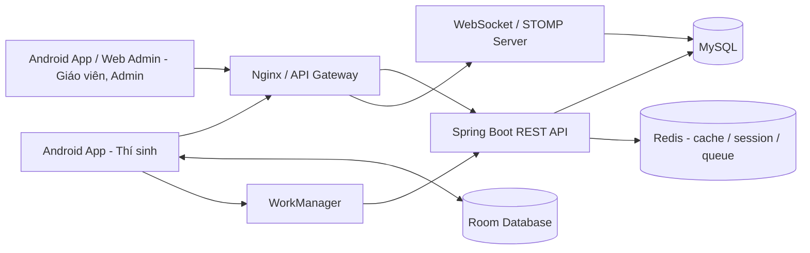

### 3.2 Thành phần chính
- **Android App**: giao diện thi, quản lý tài khoản người dùng, lưu đề và đáp án tạm thời, đồng bộ khi có mạng.
- **REST API**: xác thực, quản lý câu hỏi, quản lý đề thi, lưu kết quả, thống kê.
- **WebSocket**: cập nhật trạng thái làm bài, cảnh báo gian lận, heartbeat, thông báo realtime.
- **MySQL**: lưu dữ liệu nghiệp vụ chính.
- **Room**: lưu đề thi, trạng thái câu trả lời, đồng bộ tạm thời trên thiết bị.
- **WorkManager**: đồng bộ hậu trường khi mạng phục hồi.

### 3.3 Nguyên tắc thiết kế
- Tách rõ nghiệp vụ thi và nghiệp vụ quản trị.
- Tối ưu cho trải nghiệm mobile trong quá trình làm bài.
- Có cơ chế audit log để truy vết thao tác và gian lận.
- Thiết kế theo hướng mở rộng cho nhiều loại câu hỏi và nhiều môn học.

### 3.4 Thiết kế phân quyền RBAC

Hệ thống dùng mô hình RBAC để tách biệt rõ giữa danh tính người dùng, vai trò nghiệp vụ và quyền thao tác chi tiết. Mỗi request đi qua lớp xác thực và ủy quyền trước khi vào service.

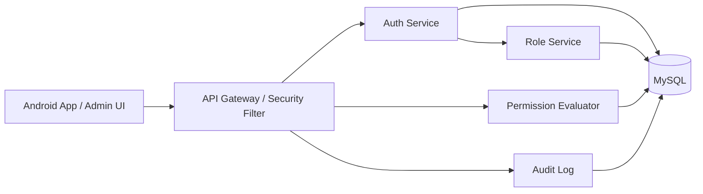

#### 3.4.1 Quy tắc phân quyền
- **Admin**: toàn quyền quản trị hệ thống, tài khoản, cấu hình và báo cáo.
- **Giáo viên**: quản lý ngân hàng câu hỏi, tạo đề, xem kết quả và thống kê trong phạm vi lớp/môn phụ trách.
- **Thí sinh**: đăng nhập, làm bài, nộp bài, xem kết quả của chính mình.
- Quyền được biểu diễn theo dạng `resource:action` như `question:create`, `exam:generate`, `exam:submit`.
- Mọi thao tác nhạy cảm phải ghi vào `audit_logs` để truy vết.

#### 3.4.2 Ma trận vai trò - quyền

| Quyền | Admin | Giáo viên | Thí sinh |
|---|---:|---:|---:|
| `user:create` | x |  |  |
| `user:update` | x |  |  |
| `user:lock` | x |  |  |
| `question:create` | x | x |  |
| `question:update` | x | x |  |
| `question:delete` | x | x |  |
| `exam:create` | x | x |  |
| `exam:generate` | x | x |  |
| `exam:download` | x |  | x |
| `exam:submit` | x |  | x |
| `exam:grade` | x | x |  |
| `exam:viewResults` | x | x | x |

#### 3.4.3 Luồng kiểm tra quyền
1. Người dùng đăng nhập và nhận access token chứa định danh phiên.
2. API xác thực token và nạp danh sách quyền hiệu lực từ `roles`, `role_permissions` và `user_roles`.
3. Security filter so sánh `resource:action` của request với tập quyền của người dùng.
4. Nếu không đủ quyền, hệ thống từ chối request và ghi `audit_logs` với kết quả `deny`.
5. Nếu hợp lệ, request đi tiếp vào service và cuối cùng được ghi `allow` khi hoàn tất thao tác nhạy cảm.

## 4. Use Case Tổng Quát

### 4.1 Tác nhân
- **Admin**: quản lý hệ thống, tài khoản, thống kê.
- **Giáo viên**: tạo câu hỏi, tạo đề thi, theo dõi kết quả.
- **Thí sinh**: đăng ký, đăng nhập, làm bài thi, xem kết quả.

### 4.2 Danh sách use case chính
- Đăng ký tài khoản thí sinh.
- Đăng nhập và phân quyền.
- Quản lý tài khoản.
- Gán vai trò và kiểm tra quyền truy cập.
- Quản lý ngân hàng câu hỏi.
- Import câu hỏi từ Excel.
- Tạo đề thi thủ công.
- Sinh đề thi tự động.
- Thi trên mobile.
- Tự lưu và đồng bộ bài làm.
- Nộp bài / tự nộp khi hết giờ.
- Chống gian lận và ghi log hành vi.
- Chấm điểm tự động.
- Xem kết quả thi.
- Xem thống kê và xuất báo cáo.
- Gửi thông báo / email.

### 4.3 Use case tổng quát

```mermaid
flowchart TD
    Admin((Admin))
    Teacher((Giáo viên))
    Student((Thí sinh))

    UC1[Đăng nhập / Phân quyền]
    UC2[Quản lý tài khoản]
    UC3[Quản lý câu hỏi]
    UC4[Import Excel]
    UC5[Tạo đề thủ công]
    UC6[Sinh đề tự động]
    UC7[Làm bài thi]
    UC8[Tự lưu / Đồng bộ]
    UC9[Nộp bài / Auto submit]
    UC10[Chống gian lận]
    UC11[Chấm điểm tự động]
    UC12[Xem kết quả]
    UC13[Thống kê / Báo cáo]
    UC14[Thông báo]

    Admin --> UC1
    Admin --> UC2
    Admin --> UC13
    Teacher --> UC1
    Teacher --> UC3
    Teacher --> UC4
    Teacher --> UC5
    Teacher --> UC6
    Teacher --> UC11
    Teacher --> UC12
    Teacher --> UC13
    Teacher --> UC14
    Student --> UC1
    Student --> UC7
    Student --> UC8
    Student --> UC9
    Student --> UC10
    Student --> UC12
    Student --> UC14
```

## 5. Use Case Detail

### 5.1 Đăng nhập và phân quyền

**Tác nhân**: Admin, Giáo viên, Thí sinh

**Mục tiêu**: xác thực người dùng, nạp đúng vai trò và quyền truy cập, đồng thời tạo phiên làm việc hợp lệ.

**Tiền điều kiện**: tài khoản đã tồn tại hoặc được tạo theo quy trình đăng ký.

**Luồng chính**:
1. Người dùng nhập MSSV / mã nhân viên / username và mật khẩu.
2. Hệ thống xác thực thông tin.
3. Hệ thống lấy các vai trò được gán trong `user_roles` và hợp nhất quyền từ `role_permissions`.
4. Hệ thống tạo token phiên đăng nhập kèm định danh và phạm vi truy cập.
5. Ứng dụng điều hướng tới giao diện tương ứng với vai trò chính hoặc bộ quyền cao nhất hiện có.

**Ngoại lệ**:
- Sai thông tin đăng nhập.
- Tài khoản bị khóa hoặc chưa được kích hoạt.
- Thiết bị khác đã đăng nhập nếu hệ thống áp dụng giới hạn 1 thiết bị.

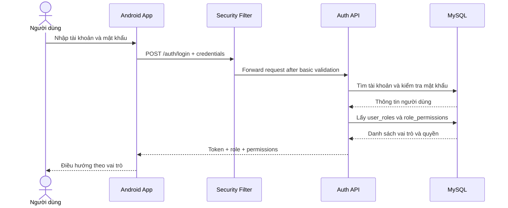

### 5.2 Quản lý tài khoản

**Tác nhân**: Admin

**Mục tiêu**: tạo, sửa, khóa, gán vai trò cho tài khoản.

**Tiền điều kiện**: admin đã đăng nhập.

**Luồng chính**:
1. Admin xem danh sách tài khoản.
2. Admin tạo mới hoặc cập nhật thông tin tài khoản.
3. Admin gán vai trò và trạng thái hoạt động thông qua `user_roles`.
4. Hệ thống lưu thay đổi và ghi log.

**Ngoại lệ**:
- Trùng mã tài khoản.
- Dữ liệu không hợp lệ.

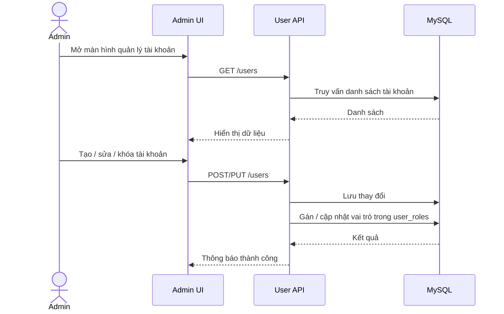

### 5.3 Quản lý ngân hàng câu hỏi

**Tác nhân**: Giáo viên, Admin

**Mục tiêu**: thêm, sửa, xóa, phân loại và quản lý nội dung câu hỏi.

**Tiền điều kiện**: người dùng có quyền quản lý câu hỏi.

**Luồng chính**:
1. Người dùng tạo mới hoặc chỉnh sửa câu hỏi.
2. Chọn loại câu hỏi, môn học, chủ đề, độ khó.
3. Nhập nội dung, đáp án, giải thích, media kèm theo.
4. Hệ thống lưu câu hỏi và các đáp án liên quan.

**Ngoại lệ**:
- Thiếu đáp án đúng.
- File media không hợp lệ.

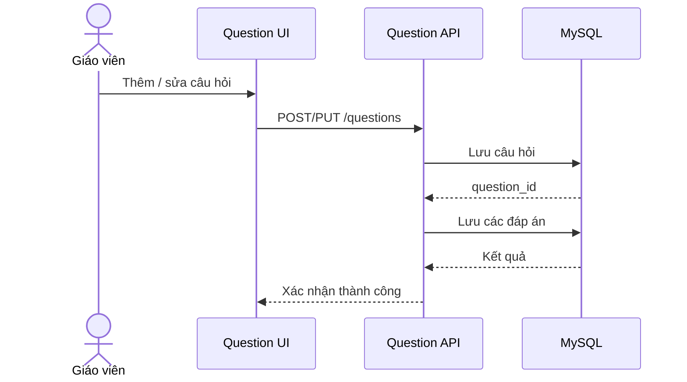

### 5.4 Import câu hỏi từ Excel

**Tác nhân**: Giáo viên, Admin

**Mục tiêu**: nhập nhanh số lượng lớn câu hỏi từ file Excel.

**Tiền điều kiện**: file đúng template quy định.

**Luồng chính**:
1. Người dùng tải file Excel lên hệ thống.
2. Hệ thống đọc dữ liệu và kiểm tra định dạng.
3. Hệ thống đối chiếu trường bắt buộc và sinh lỗi nếu sai.
4. Dữ liệu hợp lệ được lưu vào ngân hàng câu hỏi.

**Ngoại lệ**:
- Sai template.
- Trùng câu hỏi.
- Thiếu dữ liệu bắt buộc.

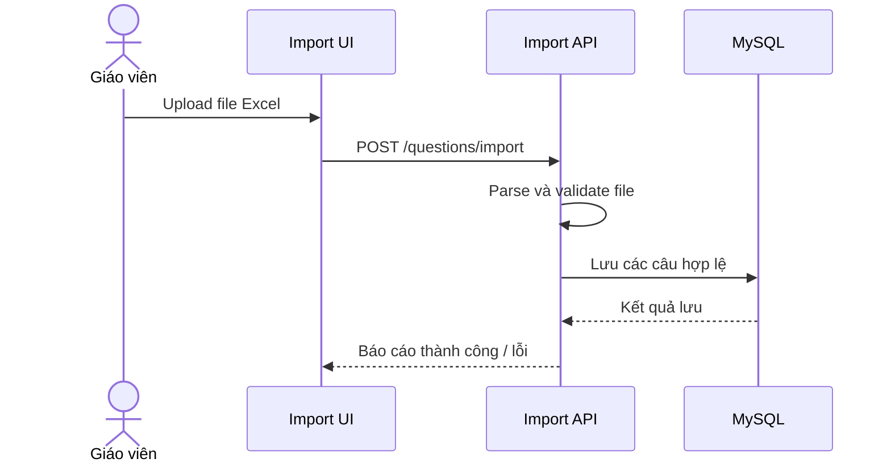

### 5.5 Tạo đề thi thủ công

**Tác nhân**: Giáo viên

**Mục tiêu**: tạo đề thi bằng cách chọn từng câu hỏi.

**Tiền điều kiện**: đã có ngân hàng câu hỏi.

**Luồng chính**:
1. Giáo viên tạo đề mới.
2. Thiết lập thời gian làm bài, thời gian mở/đóng, số câu hỏi, điểm mỗi câu.
3. Chọn từng câu hỏi từ ngân hàng.
4. Hệ thống lưu đề và danh sách câu hỏi của đề.

**Ngoại lệ**:
- Trùng câu hỏi trong cùng đề.
- Không đủ số lượng câu hỏi theo cấu hình.

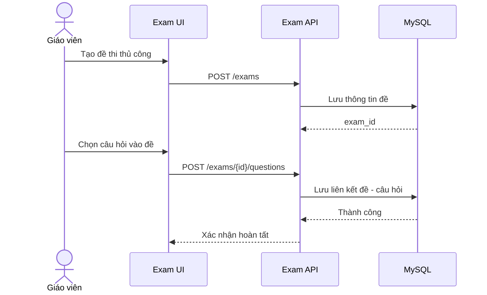

### 5.6 Sinh đề thi tự động

**Tác nhân**: Giáo viên

**Mục tiêu**: tạo đề dựa trên tiêu chí random câu hỏi và random vị trí đáp án.

**Tiền điều kiện**: câu hỏi đã được gắn môn học, chủ đề và độ khó.

**Luồng chính**:
1. Giáo viên nhập cấu hình sinh đề.
2. Hệ thống lọc câu hỏi theo điều kiện.
3. Hệ thống random câu hỏi và random vị trí đáp án.
4. Hệ thống sinh mã đề và lưu cấu hình.

**Ngoại lệ**:
- Không đủ câu hỏi phù hợp.
- Cấu hình sinh đề không hợp lệ.

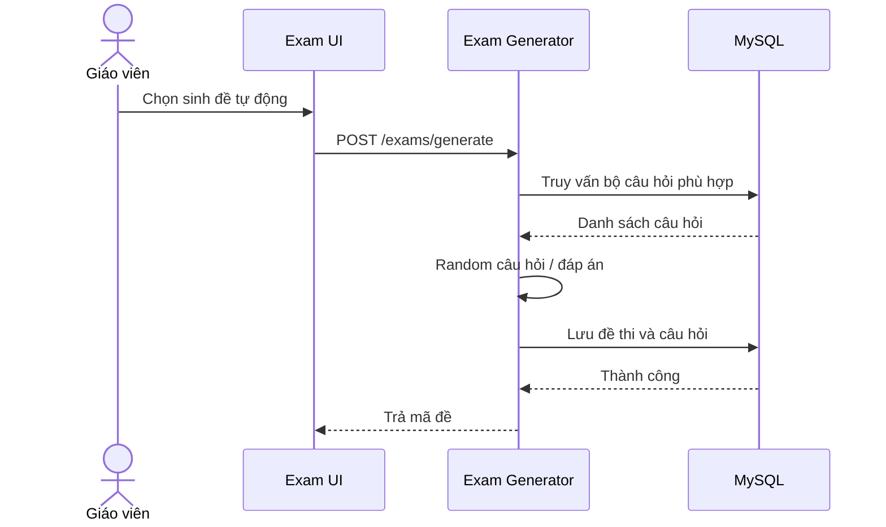

### 5.7 Làm bài thi trên mobile

**Tác nhân**: Thí sinh

**Mục tiêu**: làm bài thi trên Android với giao diện tối ưu cho mobile.

**Tiền điều kiện**: thí sinh đã đăng nhập và được phép vào phòng thi.

**Luồng chính**:
1. Thí sinh mở đề thi.
2. Ứng dụng tải đề và đáp án về máy.
3. Màn hình thi hiển thị câu hỏi, bộ đếm thời gian và điều hướng câu.
4. Mỗi lần chọn đáp án, dữ liệu được lưu ngay vào local DB.
5. Ứng dụng cập nhật trạng thái bài làm realtime nếu có mạng.

**Ngoại lệ**:
- Mất mạng giữa chừng.
- Hết thời gian làm bài.
- Thí sinh thoát app hoặc chuyển nền.

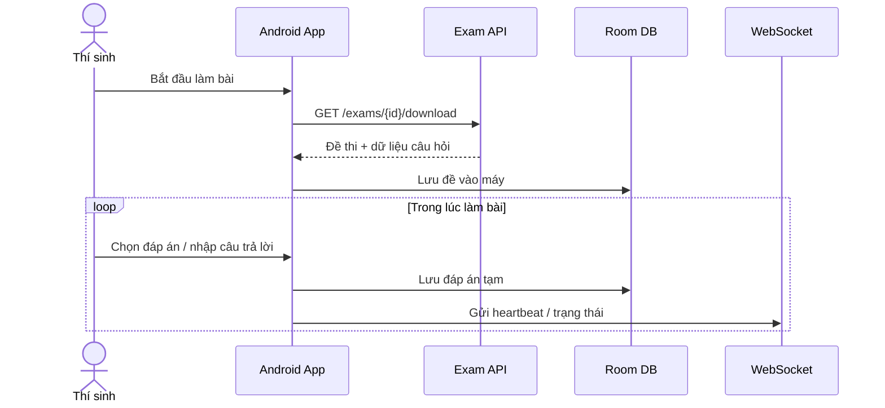

### 5.8 Tự lưu và đồng bộ bài làm

**Tác nhân**: Thí sinh, hệ thống nền

**Mục tiêu**: bảo toàn bài làm khi mất mạng và đồng bộ lại khi có internet.

**Tiền điều kiện**: bài làm đã được lưu cục bộ.

**Luồng chính**:
1. Mỗi thay đổi của thí sinh được lưu vào Room.
2. WorkManager kiểm tra kết nối mạng định kỳ.
3. Khi có mạng, hệ thống đẩy dữ liệu lên server.
4. Server cập nhật trạng thái đồng bộ.

**Ngoại lệ**:
- Đồng bộ lỗi do xung đột phiên.
- Server không phản hồi.

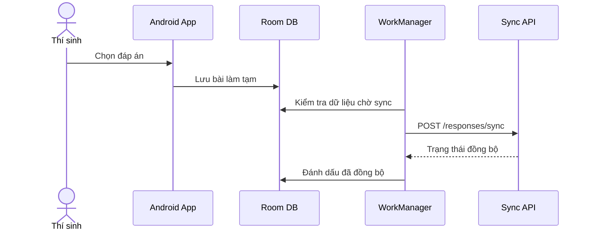

### 5.9 Nộp bài và tự nộp khi hết giờ

**Tác nhân**: Thí sinh, hệ thống

**Mục tiêu**: nộp bài thủ công hoặc tự động khi hết thời gian.

**Tiền điều kiện**: bài thi đang ở trạng thái làm bài.

**Luồng chính**:
1. Thí sinh bấm nộp bài hoặc timer về 0.
2. Hệ thống tổng hợp toàn bộ đáp án hiện có.
3. Bài làm được gửi lên server.
4. Server khóa bài thi và chuyển sang chấm điểm.

**Ngoại lệ**:
- Mất mạng tại thời điểm nộp bài.
- Bài đã hết giờ nhưng chưa đồng bộ hoàn tất.

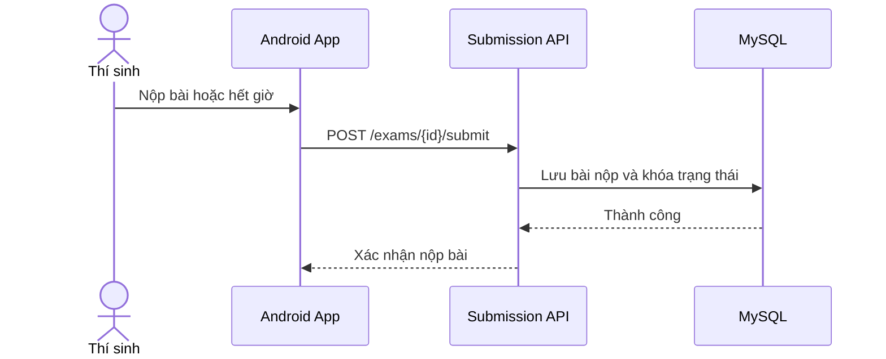

### 5.10 Chống gian lận và ghi log hành vi

**Tác nhân**: Hệ thống, thí sinh, giáo viên theo dõi

**Mục tiêu**: giảm rủi ro gian lận và lưu nhật ký hành vi.

**Tiền điều kiện**: bài thi đang diễn ra.

**Luồng chính**:
1. Ứng dụng bật chế độ chặn screenshot bằng FLAG_SECURE.
2. Khi thí sinh chuyển app hoặc thoát màn hình thi, ứng dụng ghi log.
3. Hệ thống gửi cảnh báo realtime qua WebSocket.
4. Giáo viên có thể theo dõi log gian lận trong dashboard.

**Ngoại lệ**:
- Thiết bị không hỗ trợ chặt chẽ các hạn chế hệ điều hành.
- Mất kết nối realtime trong thời gian ngắn.

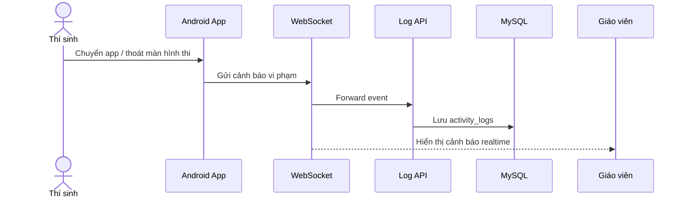

### 5.11 Chấm điểm tự động

**Tác nhân**: Hệ thống, giáo viên xem kết quả

**Mục tiêu**: chấm điểm ngay sau khi nộp bài.

**Tiền điều kiện**: bài thi đã nộp.

**Luồng chính**:
1. Server lấy đề thi, đáp án chuẩn và bài làm của thí sinh.
2. Hệ thống đối chiếu từng câu.
3. Hệ thống tính điểm theo thang điểm cấu hình.
4. Kết quả được lưu và sẵn sàng hiển thị.

**Ngoại lệ**:
- Câu hỏi tự luận không được hỗ trợ chấm tự động trong phạm vi hiện tại.
- Thiếu đáp án chuẩn hoặc cấu hình điểm.

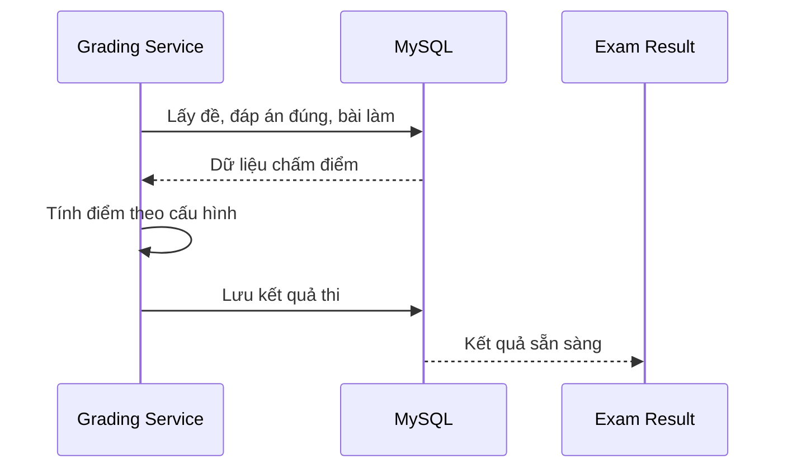

### 5.12 Xem kết quả thi

**Tác nhân**: Thí sinh, Giáo viên, Admin

**Mục tiêu**: xem điểm, đáp án đúng/sai và giải thích nếu có.

**Tiền điều kiện**: bài thi đã được chấm.

**Luồng chính**:
1. Người dùng mở màn hình kết quả.
2. Hệ thống tải điểm số, chi tiết câu trả lời và đáp án chuẩn.
3. Nếu cấu hình cho phép, hệ thống hiển thị giải thích đáp án.

**Ngoại lệ**:
- Kết quả chưa sẵn sàng.
- Quyền xem bị giới hạn theo chính sách.

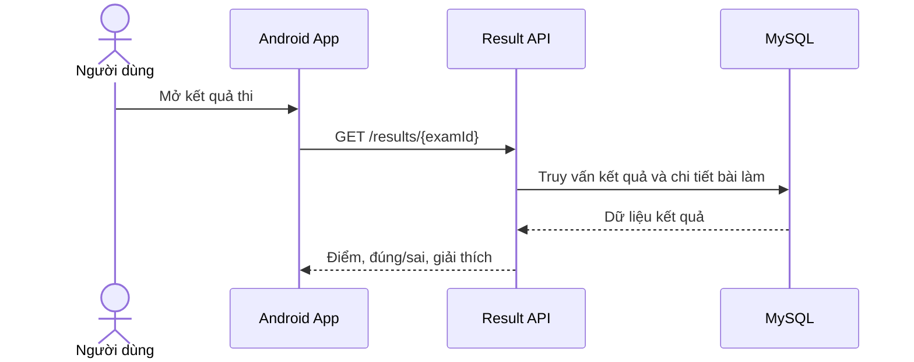

### 5.13 Xem thống kê và xuất báo cáo

**Tác nhân**: Giáo viên, Admin

**Mục tiêu**: xem top điểm cao, tỷ lệ đúng theo câu, biểu đồ và xuất Excel/PDF.

**Tiền điều kiện**: đã có dữ liệu kết quả thi.

**Luồng chính**:
1. Người dùng chọn kỳ thi hoặc nhóm dữ liệu.
2. Hệ thống tổng hợp số liệu.
3. Dashboard hiển thị biểu đồ và bảng thống kê.
4. Người dùng xuất file báo cáo khi cần.

**Ngoại lệ**:
- Không có dữ liệu thống kê.
- Lỗi tạo file xuất báo cáo.

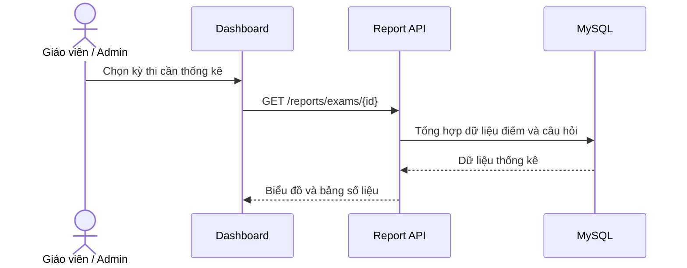

### 5.14 Thông báo lịch thi và kết quả

**Tác nhân**: Hệ thống

**Mục tiêu**: gửi push notification, email xác nhận, thông báo kết quả.

**Tiền điều kiện**: người dùng đã đăng ký nhận thông báo.

**Luồng chính**:
1. Hệ thống phát sinh sự kiện lịch thi hoặc có kết quả mới.
2. Notification service tạo nội dung thông báo.
3. Hệ thống gửi push notification hoặc email.

**Ngoại lệ**:
- Thiết bị không nhận được push.
- Email bị lỗi SMTP hoặc bị chặn.

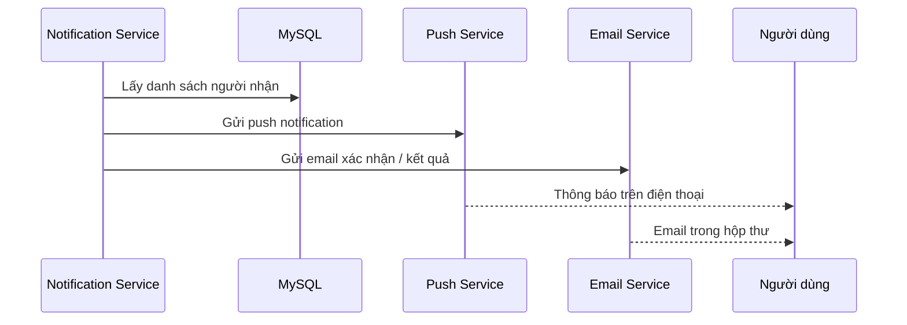

## 6. Class Diagram

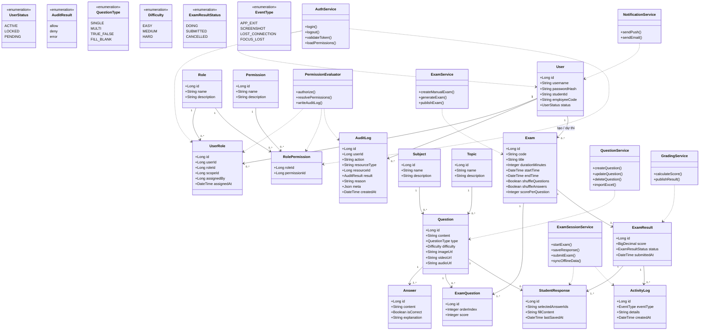

## 7. Thiết Kế Lớp Và Luồng Dữ Liệu

### 7.1 Lớp nghiệp vụ cốt lõi
- `User`, `Role`, `Permission`, `UserRole`, `RolePermission`: quản lý người dùng và quyền theo RBAC.
- `Question`, `Answer`, `Subject`, `Topic`: mô hình ngân hàng câu hỏi.
- `Exam`, `ExamQuestion`: mô hình đề thi và cấu hình đề.
- `ExamResult`, `StudentResponse`: mô hình kết quả và bài làm.
- `ActivityLog`, `AuditLog`: ghi nhật ký chống gian lận, giám sát và truy vết quyền.

### 7.2 Lớp dịch vụ
- `AuthService`: xác thực và phân quyền.
- `PermissionEvaluator`: kiểm tra quyền và ghi audit log.
- `QuestionService`: CRUD và import Excel.
- `ExamService`: tạo đề thủ công và tự động.
- `ExamSessionService`: xử lý thi, lưu tạm, đồng bộ và nộp bài.
- `GradingService`: chấm điểm và phát hành kết quả.
- `NotificationService`: push notification và email.

## 8. Yêu Cầu Phi Chức Năng

### 8.1 Hiệu năng
- Hỗ trợ khoảng 100 người dùng đồng thời.
- Phản hồi giao diện thi nhanh và ổn định.
- Đồng bộ bài làm khi có mạng mà không làm gián đoạn trải nghiệm thi.

### 8.2 Bảo mật
- Phân quyền theo vai trò.
- Mã hóa mật khẩu bằng bcrypt hoặc tương đương.
- Ghi nhật ký hoạt động và sự kiện bất thường.
- Chặn screenshot bằng cơ chế hệ điều hành Android khi khả dụng.

### 8.3 Tin cậy
- Tự lưu bài làm cục bộ để tránh mất dữ liệu.
- Có cơ chế đồng bộ lại sau khi mất mạng.
- Có trạng thái bài thi rõ ràng: đang làm, đã nộp, bị hủy.

### 8.4 Khả dụng
- Giao diện mobile dễ dùng, responsive, thao tác nhanh.
- Thông báo realtime cho giáo viên khi có sự kiện thi hoặc vi phạm.

## 9. Kết Luận

Hệ thống được thiết kế theo mô hình client-server với Android là kênh thi chính, Spring Boot xử lý nghiệp vụ trung tâm và MySQL lưu trữ dữ liệu. Bộ use case, sequence diagram và class diagram ở trên bao phủ đầy đủ các yêu cầu cốt lõi của đề tài: quản lý câu hỏi, tạo đề, làm bài thi, chống gian lận, chấm điểm, xem kết quả, thống kê và đồng bộ offline/online.

## 10. Phân Quyền và Triển Khai Kỹ Thuật

Phần này mô tả cách triển khai RBAC bằng Spring Security, JWT và audit log để khớp với schema `roles`/`permissions`/`role_permissions`/`user_roles`.

### 10.1 Mục tiêu
- Bảo đảm kiểm soát truy cập chính xác cho Admin / Teacher / Student.
- Giữ mô hình đơn giản, dễ kiểm thử, phù hợp với quy mô 100 người dùng đồng thời.

### 10.2 Thiết kế dữ liệu quyền
- `roles`: danh mục vai trò hệ thống.
- `permissions`: danh mục quyền chi tiết theo `resource:action`.
- `role_permissions`: ánh xạ vai trò sang quyền.
- `user_roles`: ánh xạ người dùng sang vai trò, có thể mở rộng theo `scope_id` nếu cần.
- `audit_logs`: ghi lại quyết định quan trọng và thao tác nhạy cảm.

### 10.3 Luồng kiểm tra quyền
1. API Gateway hoặc reverse proxy kiểm tra token hợp lệ và chuyển request vào backend.
2. Spring Security Authentication Filter xác thực token và nạp `Authentication`.
3. Permission evaluator đọc quyền từ `user_roles` và `role_permissions`.
4. Controller hoặc service guard kiểm tra quyền trước khi xử lý nghiệp vụ.
5. Mọi lần từ chối hoặc thao tác nhạy cảm đều ghi vào `audit_logs`.

### 10.4 JWT và quản lý phiên
- Dùng access token ngắn hạn để giảm rủi ro lộ token.
- Claims tối thiểu gồm `sub`, `roles`, và thông tin phạm vi nếu có.
- Khi cần thu hồi phiên, backend vô hiệu hóa refresh token hoặc session tương ứng.

### 10.5 Kiểm thử
- Unit: kiểm thử `PermissionEvaluator` với các tổ hợp role và permission.
- Integration: kiểm thử ma trận `role × action` cho các endpoint chính.
- E2E: kiểm thử các luồng đăng nhập, vào phòng thi, nộp bài và xem kết quả theo đúng quyền.
